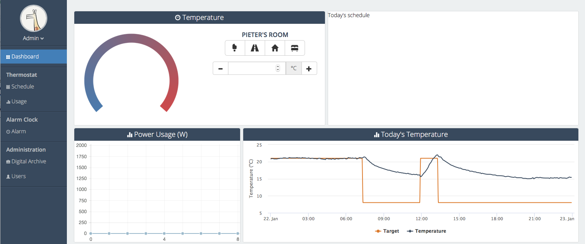
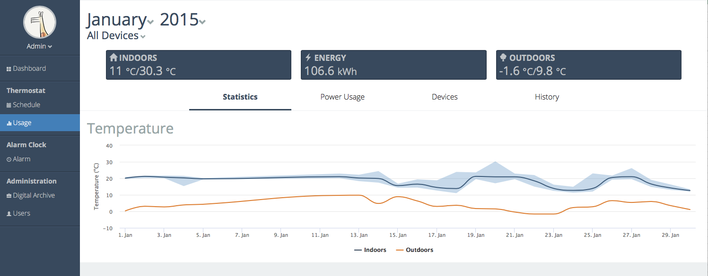
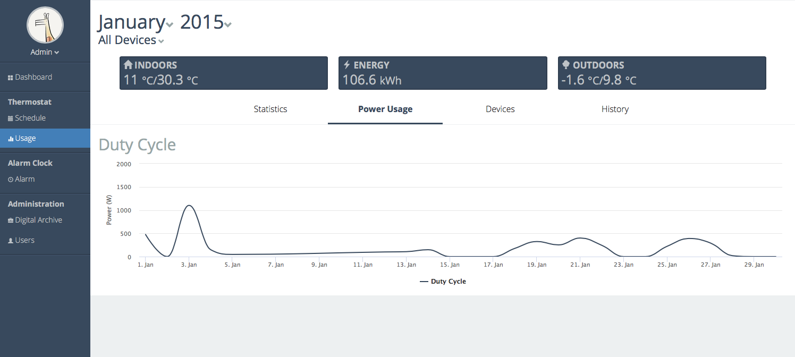
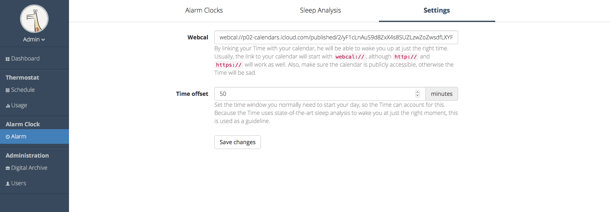
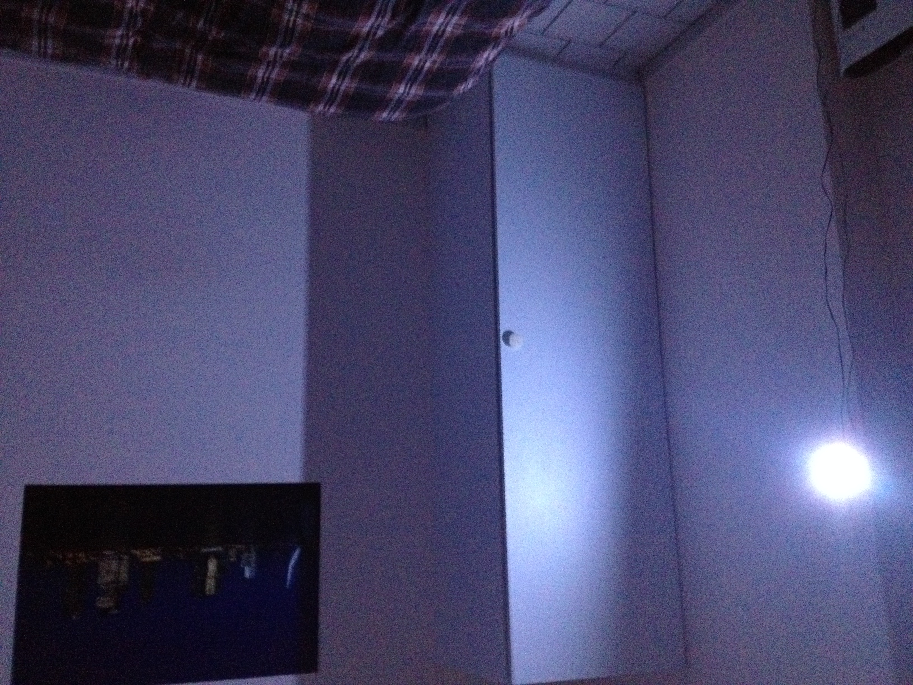

# Thermostat
An online thermostat, made with a Spark Core. 

This project was made for my dorm room, which was heated with an electric heater. This could easily be controlled with a solid state relais. This enabled me to use a PID-controller on a MCU; instead of the basic on/off functionality of the heater.

After another WiFi-system was installed, on which I couldn't connect my Spark Core, the project was basically abandoned and replaced by an Arduino with the same PID code, but no internet connection.

## Dashboard
The project exists of a dashboard and various detailed views. The dashboard has a quick overview of the temperature during the day and some functions to set various thermostat modes. For example `away` or `home`. 

## Usage page
The usage page displays energy usage (in Wh, estimated by the duty cycle on the MCU) and provides some insight by visualising both interior and exterior temperature. Both are processed daily. Calculating averages, min and max temperature and integrating the power in Watts, all based on the data collected during the day.

## Automation
The project has some automation, there was a fixed `to bed`-event, which lowers the temperature to 18°C and disabled all lights on the controller. Another state is the `away`-state, where basically all heating is disabled until presence is detected (and with a safety).

To switch to `home`, the thermostat has various options
- Geofencing, automatically starting to heat when I am nearby
- Mobile web-app, which can overwrite the `away` detection and start heating
- Light changes, using a photoresistor the presence of a user is determined.
- Schedule, this was hardcoded and had no UI aside from the calendar parsing tabblad. 

Because of some overlapping functionality, there is also the option to use the thermostat as an alarm clock. This is later continued in another device. But the thermostat will parse an ical-calendar and start to heat the room pro-actively. Later, the feature to light up the room with it's control leds was added. 

